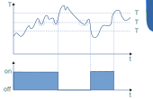

---
title: "Instrukcja laboratorium systemów wbudowanych"
subtitle: "Ćwiczenie 7: Sterowanie z histerezą i dostęp do pamięci EEPROM mikrokontrolera"
author: [Mariusz Chilmon <<mariusz.chilmon@ctm.gdynia.pl>>]
lang: "pl"
titlepage: yes
titlepage-logo: "logo.jpg"
colorlinks: yes
header-includes: |
  \usepackage{awesomebox}
  \usepackage{gensymb}
...

> People think that computer science is the art of geniuses but the actual reality is the opposite, just many people doing things that build on eachother, like a wall of mini stones.
>
> — _Donald Knuth_

# Cel ćwiczenia

Celem ćwiczenia jest zapoznanie się z:

* realizacją menu konfiguracyjnego na wyświetlaczu alfanumerycznym,
* sterowaniem temperaturą z uwzględenieniem histerezy,
* obsługą wbudowanej w mikrokontroler pamięci EEPROM.

# Uruchomienie programu wyjściowego

1. Umieść zworki na pinach `RS`, `E` i `D4`…`D7` złącza `J10` (na lewo od buzzera).
1. Zworkę `J15` (nad buzzerem) ustaw w pozycji `RW->GND`.
1. Umieść wyświetlacz w złączu `DIS1`.
1. Podłącz pin `1WIRE` pod wyświetlaczem siedmiosegmentowym LED do pinu `PD0` mikrokontrolera.
1. Podłącz pin `ENC0 B` pod wyświetlaczem siedmiosegmentowym LED do pinu `PD1` mikrokontrolera.
1. Podłącz pin `ENC0 A` pod wyświetlaczem siedmiosegmentowym LED do pinu `PD2` mikrokontrolera.
1. Podłącz diodę `LED1` do pinu `PD3` mikrokontrolera.
1. Podłącz pin `ENC0 SW` pod wyświetlaczem siedmiosegmentowym LED do pinu `PD4` mikrokontrolera.
1. Po włączeniu zasilania wyświetlacz pokaże bieżącą temperaturę `Tcurrent` oraz temperaturę zadaną `Tt`.
1. Po wciśnięciu przyciska impulsatora możliwe jest ustawienie temperatury zadanej.
1. Gdy temperatura bieżąca jest niższa od zadanej, włączana jest `LED1`.

# Zadanie podstawowe

## Wymagania funkcjonalne

Celem zadania podstawowego jest dodanie do termostatu regulowanej histerezy oraz rozbudowa menu obsługiwanego przez wyświetlacz alfanumeryczny i impulsator.

{width=400px}

Zadaniem histerezy jest zmniejszenie częstotliwości przełączania elementu wykonawczego, kosztem zmniejszenia precyzji regulowanego parametru.

W naszym przypadku, gdy mierzona temperatura oscyluje wokół temperatury zadanej $T_t$ np. z powodu ruchu powietrza w pomieszczeniu albo szumu pomiarowego, może dojść do sytuacji, gdy element wykonywaczy byłby przełączany w bardzo krótkich odcinkach czasu. Jest to zjawisko, które może być szkodliwe dla elementu sterującego (np. w przekaźniku może dojść do wypalenia styków), jak i dla elementu wykonawczego (np. kompresor w lodówce może ulec szybkiemu zużyciu).

Histereza zazwyczaj jest jednym z parametrów, które są dostępne dla użytkownika jako nastawa, co pozwala mu ustalić kompromis między precyzją sterowania a częstotliwością przełączania.

## Modyfikacja programu

1. Dodaj do klasy `Menu` obsługę jeszcze jednego obiektu typu `Parameter`, który będzie odpowiedzialny za wyświetlanie i zmianę wartości histerezy.
1. Ogranicz zakres zmian temperatury zadanej do zakresu 0°C…40°C, a histerezy do zakresu 0°C…5°C.
1. Zmodyfikuj metodę `Thermostat::onTemperature()` tak, by uwzględniała temperaturę zadaną $T_t$ i histerezę $T_h$, tj. włączenie grzałki ma następować przy temperaturze $T_t + T_h$ zaś wyłączenie przy temperaturze $T_t - T_h$.

# Zadanie rozszerzone

## Wymagania funkcjonalne

Celem zadania rozszerzonego jest dodanie do termostatu nieulotnej pamięci temperatury zadanej.

1. Po wyjściu z edycji nastaw ustawione wartości zapisywane są w pamięci EEPROM mikrokontrolera.
1. Po zresetowaniu mikrokontrolera wczytywana jest zapamiętana temperatura.

## Modyfikacja programu

1. Do klasy `Settings` dodaj metody `save()` i `restore()`, które — odpowiednio — zapiszą i&nbsp;przywrócą z pamięci EEPROM temperaturę zadaną i histerezę.
1. Wywołaj je w metodzie `Menu::onEncoderPress()` i w funkcji `main()`.

\awesomebox[purple]{2pt}{\faMicrochip}{purple}{Pamięć EEPROM ma ograniczoną liczbę cykli czyszczenia/zapisu (w przypadku mikrokokntrolerów AVR gwarantowana wartość to 100~000), należy więc zadbać, by ograniczyć miejsca w~programie, gdzie może następować zapis.}

\awesomebox[teal]{2pt}{\faCode}{teal}{W pliku nagłówkowym \lstinline{avr/eeprom.h} zadeklarowane są funkcje obsługujące pamięć EEPROM. Należy zauważyć, że zamiast funkcji z grupy \lstinline{eeprom_write_XXX()} warto użyć funkcji \lstinline{eeprom_update_XXX()}, które dokonują zapisu tylko, gdy nowa wartość różni się od poprzedniej.}

\awesomebox[purple]{2pt}{\faMicrochip}{purple}{Wyczyszczona pamięć EEPROM nie jest wypełniona bajtami \lstinline{0x00}, ale \lstinline{0xFF}. Jest to częsta cecha pamięci nieulotnych.}

\awesomebox[teal]{2pt}{\faCode}{teal}{Liczba zmiennoprzecinkowa, w której wszystkie bity wykładnika są ustawione (co ma miejsce w wyczyszczonej pamięci EEPROM), nie jest poprawną wartością, ale \textit{nie-liczbą} (ang. \textit{NaN} — \textit{Not a Number}). Wartość taką można wykryć za pomocą makra \lstinline{isnan()} zdefiniowanego w pliku nagłówkowym \lstinline{math.h}.}
