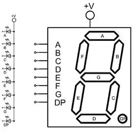

---
title: "Instrukcja laboratorium systemów wbudowanych"
subtitle: "Ćwiczenie 9: Programowe tłumienie drgań styków i&nbsp;multipleksowanie wyświetlacza siedmiosegmentowego"
author: [Mariusz Chilmon <<mariusz.chilmon@ctm.gdynia.pl>>]
lang: "pl"
titlepage: yes
titlepage-logo: "logo.jpg"
colorlinks: yes
header-includes: |
  \usepackage{awesomebox}
  \usepackage{gensymb}
...

> If you can't describe what you are doing as a process, you don't know what you're doing.
>
> — _W. Edwards Deming_

# Cel ćwiczenia

Celem ćwiczenia jest zapoznanie się z:

* programowym tłumieniem drgań styków,
* definiowanie cyfr na wyświetlaczu siedmiosegmentowym,
* multipleksowaniem wyświetlacza siedmiosegmentowego.

# Uruchomienie programu wyjściowego

1. Segmenty i kropkę `A`…`H` wyświetlacza siedmiosegmentowego podłącz do kolejnych pinów `PA0`…`PA7` mikrokontrolera.
1. Cyfry `DIG1`…`DIG4` wyświetlacza siedmiosegmentowego podłącz do kolejnych pinów `PB0`…`PB3` mikrokontrolera.
1. Przyciski `K1` i `K2` podłącz do pinów `PB4` i `PB5` mikrokontrolera.
1. Na wyświetlaczu widoczna jest pojedyncza cyfra _0_.

# Zadanie podstawowe

## Wymagania funkcjonalne

Celem zadania podstawowego jest wykorzystanie multipleksowania w celu wyświetlania kolejnych liczb:

1. Wyświetlane są kolejne liczby, począwszy od `0000`.
1. Częstotliwość multipleksowania jest na tyle duża, że migotanie ekranu jest niewidoczne.

Szybkość zmiany liczb nie jest krytyczna. Ważne jest, by można było zweryfikować poprawność wyświetlania poszczególnych cyfr.

{width=200px}

{width=200px}

## Modyfikacja programu

1. W metodzie `LedDisplay::refresh()` włączaj cyklicznie kolejne cyfry wyświetlacza.
1. W pliku `timer.cpp` zmień nastawy preskalera (bity `CS00`…`CS02`) i/lub wartość wpisywaną do rejestru `OCR0A`, by zwiększyć częstotliwość wywoływania metody `LedDisplay::refresh()`.
1. W obsłudze przerwania `ISR(TIMER0_COMPA_vect)` wpisuj do tablicy `displayBuffer.digits[]` kolejne liczby.
1. Uzupełnij zawartość tablicy `DIGITS` o wzorce pozostałych cyfr. Najmniej znaczący bit (LSB) to segment _A_, zaś najbardziej znaczący (MSB) — kropka _DP_ (oznaczona na naszej płytce jako segment _H_).
1. W metodzie `LedDisplay::refresh()` wyświetl zawartość tablicy `displayBuffer.digits[]`, wykorzystując wzorce z tablicy `DIGITS`.

\awesomebox[purple]{2pt}{\faMicrochip}{purple}{Multipleksowanie polega na tym, że np. czterocyfrowy wyświetlacz złożony łącznie z $8\cdot4=32$ segmentów (wliczając kropki dziesiętne) można obsłużyć za pomocą znacznie mniejszej liczby pinów mikrokontrolera. W przypadku wświetlaczy LED na ogół wykorzystuje się część pinów do włączania na krótki czas pojedynczych cyfr i 8 pinów do włączania segmentów w aktualnie wybranej cyfrze, co w naszym przykładzie oznacza zapotrzebowanie na $8+4=12$ pinów.}

\awesomebox[purple]{2pt}{\faMicrochip}{purple}{Mikrokontroler taktowany jest zegarem 8MHz. W przypadku wykorzystania przerwania od komparatora \textit{A} timera częstotliwość ta najpierw dzielona jest przez wartość preskalera, a następnie przez wartość rejestru \lstinline{OCR0A}.}

# Zadanie rozszerzone

Celem zadania podstawowego jest oprogramowanie przycisków `K1` (_Start_) i `K2` (_Stop_), sterujących stoperem.

## Wymagania funkcjonalne

1. Szybkość odliczania wynosi 100Hz, więc pierwsze dwie cyfry odmierzają sekundy, a kolejne dwie — setne części sekundy.
1. Część całkowitą od ułamkowej oddziela kropka (segment `H`) zaświecony na drugiej (`DIG2`) cyfrze.
1. Przycisk `K1` (_Start_) uruchamia i zatrzymuje stoper.
1. Przycisk `K2` (_Reset_) zeruje stoper.
1. Urządzenie reaguje natychmiast, nawet na bardzo krótkie wciśnięcie przycisków.
1. Każde naciśnięcie przycisku `K1` (_Start_) jest interpretowane jako pojedyncze zdarzenie (wyeliminowany jest efekt drgania styków).
1. Powinna być możliwość odmierzenia interwału &lt;1&nbsp;s.

## Modyfikacja programu

1. W metodzie `LedDisplay::refresh()` dodaj zaświecanie kropki.
1. W pliku `timer.cpp` zmień nastawy preskalera (bity `CS00`…`CS02`) i/lub wartość wpisywaną do rejestru `OCR0A`, by uzyskać częstotliwość, która pozwoli odmierzać czas 0,01&nbsp;s.
1. W obsłudze przerwania `ISR(TIMER0_COMPA_vect)` wykorzystaj metodę `keypad.key()` obiektu klawiatury, by reagować na wciśnięcia przycisku.

\awesomebox[purple]{2pt}{\faMicrochip}{purple}{Timer0 jest 8-bitowy. Jeżeli preskaler oraz rejestr \lstinline{OCR0A} nie pozwalają na uzyskanie pożądanej wartości podziału, można ją uzyskać odliczając dodatkowe cykle programowo w obsłudze przerwania.}
